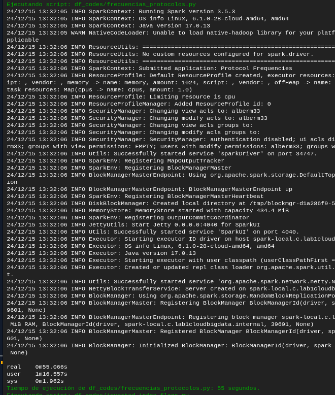
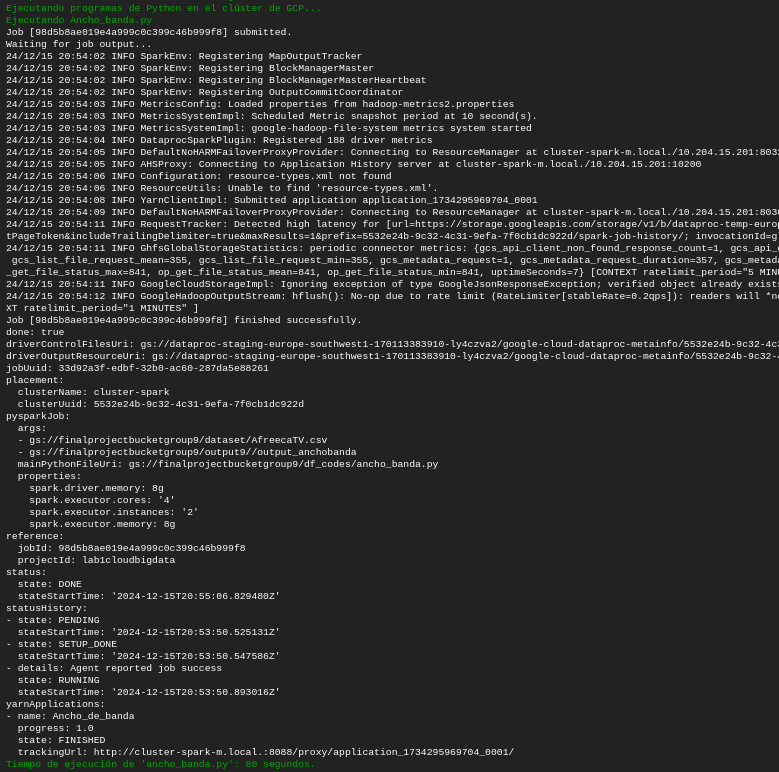
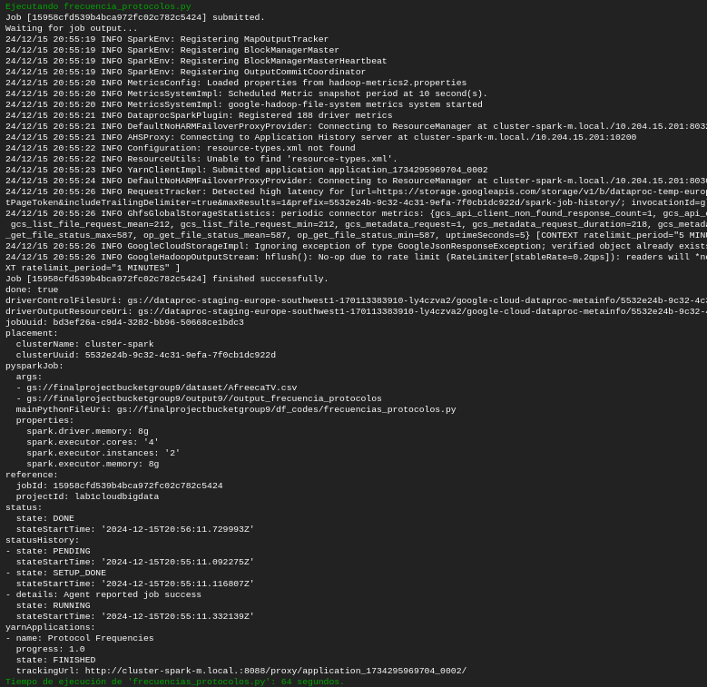
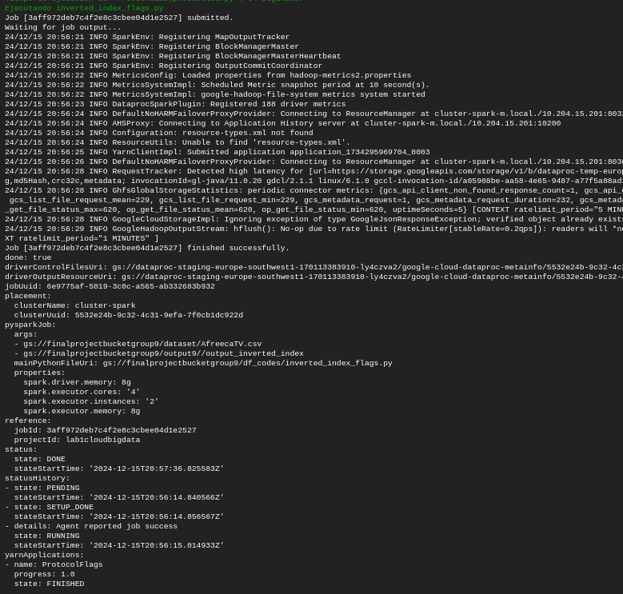
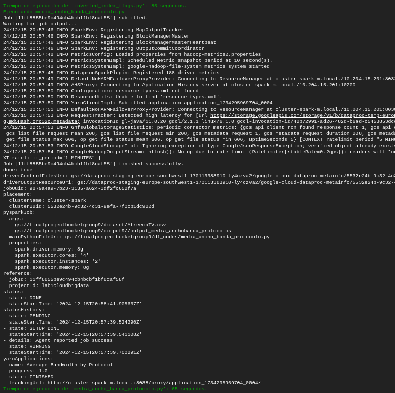
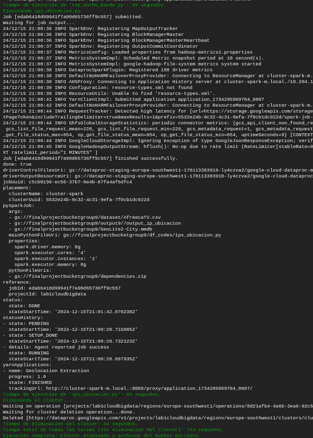
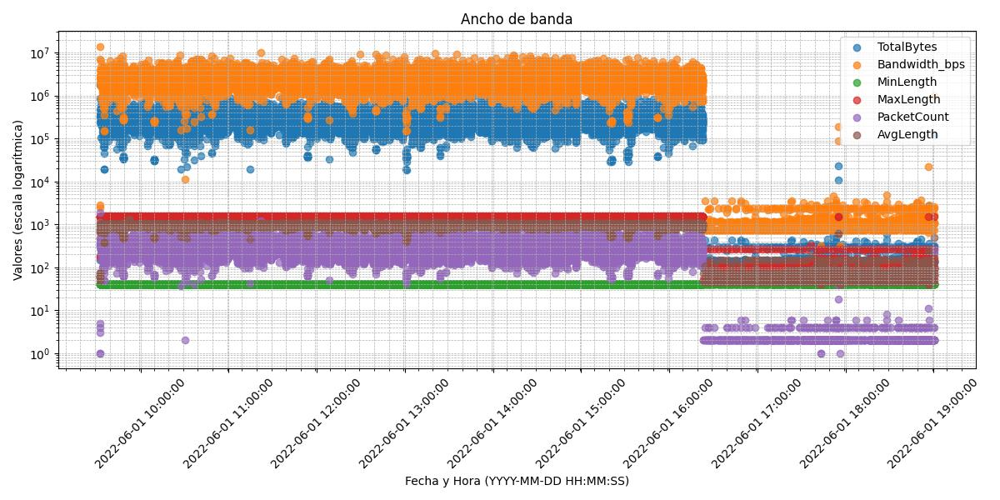
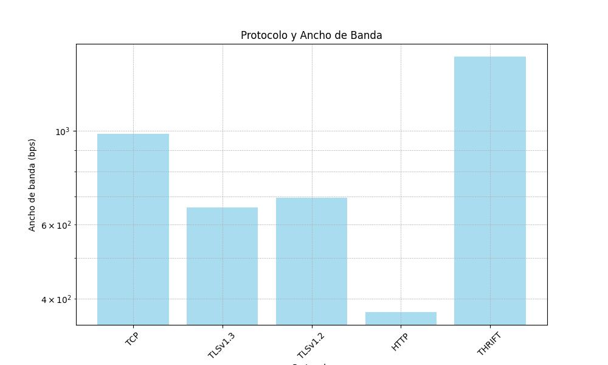
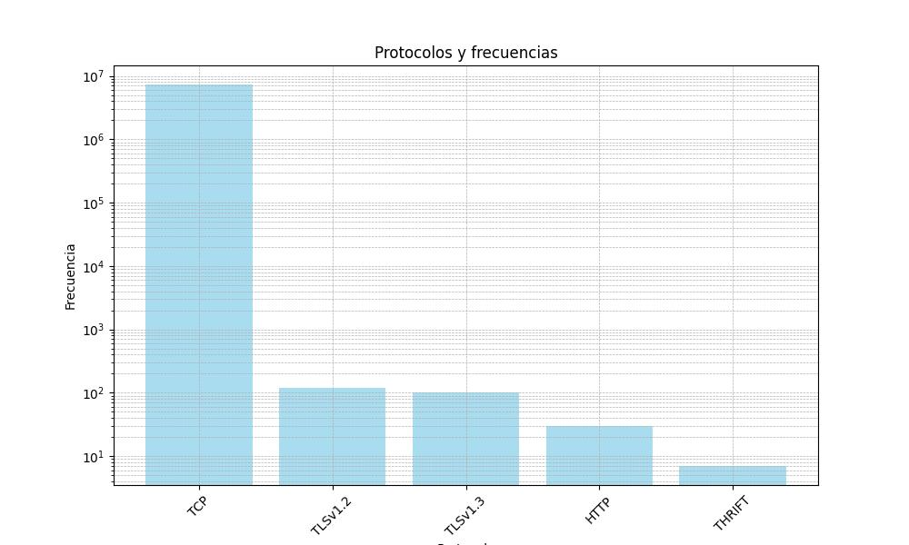

# Group9-Cloud-Big-Data

Proyecto final del grupo 9 de la asignatura de Cloud y Big Data de la Universidad Complutense de Madrid, Facultad de Informática, 2024-2025

---

## Índice

- [Group9-Cloud-Big-Data](#group9-cloud-big-data)
  - [Índice](#índice)
  - [Participantes](#participantes)
  - [Informe del Proyecto](#informe-del-proyecto)
    - [Descripción del problema](#descripción-del-problema)
    - [Necesidad del procesamiento de Big Data y la computación en la nube](#necesidad-del-procesamiento-de-big-data-y-la-computación-en-la-nube)
    - [Descripción de los datos: ¿De dónde provienen? ¿Cómo se adquirieron? ¿Qué significan? ¿En qué formato están? ¿Cuánto pesan (mínimo 1 GB)?](#descripción-de-los-datos-de-dónde-provienen-cómo-se-adquirieron-qué-significan-en-qué-formato-están-cuánto-pesan-mínimo-1-gb)
    - [Descripción Breve de la Aplicación, Modelos de Programación, Plataforma e Infraestructura](#descripción-breve-de-la-aplicación-modelos-de-programación-plataforma-e-infraestructura)
      - [**Descripción de la Aplicación**](#descripción-de-la-aplicación)
      - [**Modelos de Programación**](#modelos-de-programación)
      - [**Plataforma**](#plataforma)
      - [**Infraestructura**](#infraestructura)
    - [Diseño del software (diseño arquitectónico, base del código, dependencias…)](#diseño-del-software-diseño-arquitectónico-base-del-código-dependencias)
    - [Uso (incluyendo capturas de pantalla que demuestren su funcionamiento)](#uso-incluyendo-capturas-de-pantalla-que-demuestren-su-funcionamiento)
      - [**Uso fuera de la insfractuctura cloud**](#uso-fuera-de-la-insfractuctura-cloud)
      - [**Maquina local en el cloud**](#maquina-local-en-el-cloud)
      - [**Cluster**](#cluster)
      - [**Archivos outputs**](#archivos-outputs)
    - [Evaluación de rendimiento (aceleración) en la nube y discusión sobre los sobrecostes identificados y optimizaciones realizadas](#evaluación-de-rendimiento-aceleración-en-la-nube-y-discusión-sobre-los-sobrecostes-identificados-y-optimizaciones-realizadas)
      - [**Speed-up en maquina local con distintos hilos**](#speed-up-en-maquina-local-con-distintos-hilos)
      - [**Speed-up en maquina local con distinta cantidad de vCpus**](#speed-up-en-maquina-local-con-distinta-cantidad-de-vcpus)
      - [**Speed-up en maquina local en la nube combinando hilos y vCpus**](#speed-up-en-maquina-local-en-la-nube-combinando-hilos-y-vcpus)
      - [**Speed-up en cluster con distinta cantidad de nodos**](#speed-up-en-cluster-con-distinta-cantidad-de-nodos)
      - [**Speed-up en cluster con distinta cantidad de vCpus**](#speed-up-en-cluster-con-distinta-cantidad-de-vcpus)
      - [**Speed-up en cluster con distinta cantidad de vCpus y nodos**](#speed-up-en-cluster-con-distinta-cantidad-de-vcpus-y-nodos)
    - [Características avanzadas, como herramientas/modelos/plataformas no explicadas en clase, funciones avanzadas, técnicas para mitigar los sobrecostes, aspectos de implementación desafiantes](#características-avanzadas-como-herramientasmodelosplataformas-no-explicadas-en-clase-funciones-avanzadas-técnicas-para-mitigar-los-sobrecostes-aspectos-de-implementación-desafiantes)
    - [Conclusiones, incluyendo objetivos alcanzados, mejoras sugeridas, lecciones aprendidas, trabajo futuro, ideas interesantes](#conclusiones-incluyendo-objetivos-alcanzados-mejoras-sugeridas-lecciones-aprendidas-trabajo-futuro-ideas-interesantes)
      - [**Conclusiones**](#conclusiones)
      - [**Mejoras sugeridos y trabajo futuro**](#mejoras-sugeridos-y-trabajo-futuro)
    - [Referencias](#referencias)

## Participantes

- Alberto Martin Oruña ([@Alberto12x](https://github.com/Alberto12x/))
- José Caleb Gálvez Valladares ([@JGalvez27](https://github.com/JGalvez27/))

## Informe del Proyecto

### Descripción del problema

Se plantea desarrollar un sistema capaz de procesar, analizar y extraer información relevante a partir de grandes volúmenes de datos de tráfico de red. Este análisis es fundamental para comprender el comportamiento de las redes, detectar patrones en los flujos de tráfico, identificar posibles anomalías y apoyar la toma de decisiones en la gestión de infraestructuras tecnológicas.

El problema central es el procesamiento eficiente de grandes conjuntos de datos de tráfico de red representados en archivos CSV.

El objetivo es realizar diversas tareas de procesamiento y análisis, tales como:

- Filtrar información relevante: Extraer eventos específicos, como banderas TCP, métodos HTTP y eventos TLS o quedarse solo con los  intervalos de tiempo de 1 segundo que mas o menos ancho de banda se ha necesitado.
- Construir índices invertidos: Mapear palabras clave (como "GET", "ACK" o "Client Hello") a los paquetes donde estas ocurren, permitiendo búsquedas rápidas y eficientes para futuros algoritmos que se podrian implementar de manera que la busqueda fuera más rapida.
- Obtener métricas clave: Calcular estadísticas como la frecuencia de protocolos, el ancho de banda promedio por protocolo y por intervalos de 1 segundo el paquete mas pequeño, el más grande, la media y la cantidad de paquetes que se han capturado en ese segundo.
- Obtener la localización de las ips de modo que se puede observar para casos como videos en directo desde donde está conectada la gente que te ve.
  
El desafío principal reside en la gran escala de los datos, que puede superar varios gigabytes (en el caso de la practica no pero el trafico en la red es muy grande), y en la complejidad computacional de las tareas requeridas. Además, se busca garantizar la escalabilidad y eficiencia del procesamiento utilizando tecnologías de Big Data como Apache Spark, en combinación con infraestructuras Cloud que permitan trabajar con recursos distribuidos y escalables.

---

### Necesidad del procesamiento de Big Data y la computación en la nube

La necesidad de Big Data y computación en la nube en este proyecto radica en los retos inherentes al análisis y procesamiento de grandes volúmenes de datos de tráfico de red, que requieren herramientas y plataformas avanzadas para manejar su escala y complejidad. A continuación, se detallan las principales razones:

**1. Escalabilidad de los datos:**
Los datos de tráfico de red pueden alcanzar tamaños significativos, 400 exabytes de datos son generados al día,de los cuales gran parte se transmiten por la red; debido al volumen de paquetes generados incluso en redes moderadamente activas.
El manejo eficiente de estos volúmenes de datos excede las capacidades de los sistemas tradicionales, como bases de datos relacionales o scripts locales, lo que hace indispensable el uso de herramientas de Big Data como Apache Spark, diseñadas para procesar datos de forma distribuida.

**2. Complejidad del procesamiento:**
El análisis incluye tareas intensivas como filtrado, extracción de patrones, construcción de índices invertidos y cálculo de métricas clave. Estas operaciones implican:

- Procesamiento de texto, como el análisis de la columna Info para extraer palabras clave (banderas TCP, métodos HTTP, eventos TLS).
- Agregaciones a gran escala, como el cálculo de frecuencias o el mapeo de palabras clave a identificadores de paquetes.
  
Las tecnologías usadas en Big Data ofrece la potencia necesaria para realizar estas tareas en paralelo, reduciendo significativamente los tiempos de ejecución.

**3. Variabilidad y escalabilidad de los recursos:**
Los sistemas Cloud permiten escalar recursos computacionales dinámicamente según las necesidades:

- Añadir más nodos para acelerar el procesamiento.
- Usar configuraciones específicas (como nodos con alto rendimiento en procesamiento o memoria) según el tipo de tarea.
  
Esto reduce el costo, ya que solo se pagan los recursos utilizados, y mejora la eficiencia al evitar cuellos de botella. Esto es necesario para analizar trafico en la red ya que depende de la hora del día la cantidad de información que viaja por la red sufre cambios muy significativos , el uso del cloud como infraestructura nos permite aumentar los recursos en las horas con mas tráfico y liberar recursos cuando hay menos, disminuyundo los costes.

**4. Tolerancia a fallos:**
Los sistemas distribuidos en la nube ofrecen tolerancia a fallos integrada, asegurando que el procesamiento no se detenga ante la falla de un nodo.
Esto es esencial para garantizar la confiabilidad en el análisis de grandes volúmenes de datos.

**5. Integración con otras herramientas:**
Las plataformas de Big Data y Cloud se integran fácilmente con tecnologías avanzadas:

- Modelos de machine learning para identificar anomalías de red o predecir comportamientos.
- Dashboards y herramientas de visualización para representar métricas clave en tiempo real.
  
Esto enriquece los resultados del análisis y aumenta el valor práctico del proyecto aunque no se haya implementado.

**6. Reducción de costos y facilidad de acceso:**
Las soluciones en la nube eliminan la necesidad de una infraestructura física costosa, ofreciendo un acceso sencillo a recursos de alto rendimiento.

En conclusión, el uso de tecnologías de Big Data y computación en la nube no solo es necesario, sino que es un componente clave para garantizar el éxito del proyecto, permitiendo procesar y analizar datos masivos de manera eficiente, escalable y rentable.

---

### Descripción de los datos: ¿De dónde provienen? ¿Cómo se adquirieron? ¿Qué significan? ¿En qué formato están? ¿Cuánto pesan (mínimo 1 GB)?

Se pueden descarga el dataset en este [enlace](https://www.kaggle.com/datasets/kimdaegyeom/5g-traffic-datasets?resource=download-directory) el cual le lleva a la página donde descargarlo, además en el archivo [enlace_drive_dataset.txt](enlace_drive_dataset.txt) se encuentra un enlace a google drive donde tambien se puede descargar.

Los datos provienen de [kaggle](https://www.kaggle.com/), del post de la siguiente url : [https://www.kaggle.com/datasets/kimdaegyeom/5g-traffic-datasets?resource=download-directory](https://www.kaggle.com/datasets/kimdaegyeom/5g-traffic-datasets?resource=download-directory).

 La url además contiene más datasets con trafico de red en contextos diferentes además de la descripción de como se han obtenido cada uno de ellos.
El conjunto de datos utilizados en nuestro proyecto proviene de la plataforma Afreeca TV, que se recolectó a través de la aplicación PCAPdroid en un terminal móvil Samsung Galaxy A90 5G, equipado con un módem Qualcomm Snapdragon X50 5G. El tráfico fue medido mientras se visualizaban transmisiones en vivo de Afreeca TV, sin tráfico de fondo, para analizar las características específicas de este tipo de tráfico.

AfreecaTV es una plataforma de transmisión en vivo y video bajo demanda que se originó en Corea del Sur. El nombre “AfreecaTV” se traduce como “Anybody can Freely Broadcast TV”, lo que refleja su enfoque en permitir a cualquier persona transmitir contenido de forma gratuita. [[1]]

Este conjunto de datos contiene información detallada de los paquetes de datos transmitidos, incluyendo direcciones de origen y destino, lo que permite un análisis completo del tráfico de la aplicación. Los datos están organizados en formato CSV y cubren un total de 328 horas de tráfico, lo que hace que sea adecuado para su uso en modelos de simulación de tráfico de red, para el entrenamiento de modelos de aprendizaje automático, como redes neuronales y técnicas de pronóstico de series temporales o para el cálculo de métricas para identificar cuellos de botellas y tomar decisiones para administrar la red. [[2]]

Los datos incluyen registros de paquetes que pasan a través de la red y están organizados con las siguientes columnas:

- **No.**: Número de secuencia del paquete.
- **Time**: Timestamp del paquete, que indica la fecha y hora exacta en la que se capturó el paquete.
- **Source**: Dirección IP de origen del paquete.
- **Destination**: Dirección IP de destino del paquete.
- **Protocol**: Protocolo de la capa de transporte utilizado (por ejemplo, TCP, HTTP).
- **Length**: Longitud del paquete en bytes.
- **Info**: Información adicional sobre el paquete, que puede incluir detalles sobre la conexión, como el tipo de mensaje (SYN, ACK, GET, etc.) y valores como el número de secuencia (Seq), número de acuse de recibo (Ack), tamaño de la ventana (Win), y otros parámetros del protocolo.
  
Ejemplo de entrada en el dataset:

| No. | Time                          | Source         | Destination    | Protocol | Length | Info |
|-----|-------------------------------|----------------|----------------|----------|--------|------|
| 1   | 2022-06-01 11:32:29.301134    | 10.215.173.1   | 218.38.31.68   | TCP      | 60     | 57192  >  3456 [SYN] Seq=0 Win=65535 Len=0 MSS=1460 SACK_PERM=1 TSval=3049657187 TSecr=0 WS=128 |
| 2   | 2022-06-01 11:32:29.327373    | 218.38.31.68   | 10.215.173.1   | HTTP    | 172     | GET /check?ip=110.10.76.232&port=19000 HTTP/1.1  |
| 3   | 2022-06-01 11:32:29.327541    | 10.215.173.1   | 218.38.31.68   | TLSv1.2      | 557     | Client Hello |
| 4   | 2022-06-01 11:32:30.276864    | 192.0.0.2      | 10.215.173.2   | TLSv1.3      | 1500     | Application Data, Application Data, Application Data |

El dataset que se ha utilizado en este proyecto pesa 1.3 GB.


---

### Descripción Breve de la Aplicación, Modelos de Programación, Plataforma e Infraestructura

#### **Descripción de la Aplicación**  

El proyecto es un sistema modular diseñado para analizar y procesar grandes volúmenes de datos de tráfico de red de manera eficiente, aprovechando tecnologías de Big Data y computación en la nube. Sus objetivos principales incluyen la extracción de información relevante, la detección de patrones, la identificación de anomalías y el apoyo en la gestión de infraestructuras de red.

Utilizando Apache Spark en Google Cloud Dataproc, el sistema procesa datos almacenados en buckets de GCP (Google Cloud Storage) en formato CSV. La aplicación realiza tareas como el cálculo de métricas de ancho de banda, el análisis de frecuencias de protocolos, la creación de índices invertidos para búsquedas optimizadas y la geolocalización de direcciones IP. Está diseñada para garantizar escalabilidad, eficiencia y un uso optimizado de recursos.

#### **Modelos de Programación**  

El proyecto utiliza Apache Spark, un framework de computación distribuida, desplegado sobre Google Cloud Dataproc para el procesamiento de datos en paralelo. La principal abstracción utilizada es DataFrames, lo que aporta múltiples ventajas:

- **Lenguaje de Consultas de Alto Nivel**: Facilita operaciones similares a SQL para simplificar transformaciones complejas.
- **Optimización del Rendimiento**: El optimizador de Spark genera planes de ejecución eficientes.
- **Procesamiento Distribuido**: Las tareas se dividen entre nodos de Dataproc, habilitando un alto paralelismo.
  
Herramientas y bibliotecas clave utilizadas:

1. **PySpark**: Facilita la interacción con Spark desde Python.
2. **GeoIP2**: Proporciona capacidades de geolocalización de IPs.
3. **Python**: Es el lenguaje principal para la manipulación de datos y la orquestación.

Los scripts incluyen:

- Análisis de Ancho de Banda: Agrega métricas de tráfico en ventanas de 1 segundo.
- Frecuencia de Protocolos: Calcula la frecuencia de uso de diferentes protocolos.
- Índice Invertido: Mapea términos como flags TCP y métodos HTTP a paquetes asociados.
- Geolocalización: Extrae información geográfica de direcciones IP únicas utilizando la base de datos GeoLite2.
- Herramientas de filtrado como "top k" o filtrado por umbral.

#### **Plataforma**  

La aplicación puede ejecutarse en:

1. **Entorno Local**: Usando un entorno virtual de Python para pruebas a pequeña escala.
2. **Infraestructura en la Nube**:
   - Usando una instacia normal en GCP.
   - Usando clusters de  Google Cloud Dataproc y almacenando los datos de entrada y salida en Google Cloud Storage, buckets. Los scripts gestionan automáticamente la provisión y liberación de recursos, optimizando costes y uso.

#### **Infraestructura**  

La infraestructura combina los siguientes elementos:

1. **Recursos de Cómputo**:
   - **Google Cloud Dataproc**: Plataforma administrada que soporta Apache Spark para tareas distribuidas.
   - **Máquinas Virtuales**: Instancias personalizables creadas dinámicamente en GCP para soportar tareas distribuidas con Spark.
   - **Configuración Local**: Entornos virtuales en Python 3.12 con dependencias instaladas desde [requirements.txt](requirements.txt). Los conjuntos de datos y los resultados se gestionan localmente para cargas de trabajo menores o pruebas.
2. **Almacenamiento**:
   - **Sistema de Archivos Distribuido**: Spark procesa entradas desde almacenamiento de objetos en la nube (por ejemplo, GCP Cloud Storage).
   - **Almacenamiento Local**: Usado para resultados intermedios durante pruebas locales.
3. **Redes**:
   - El conjunto de datos incluye campos relacionados con IPs, permitiendo simulaciones de optimización y enrutamiento de redes.
   - La transferencia de datos dentro de GCP optimiza costes mediante su red interna.
4. **Seguridad**:
   - Asegurada mediante políticas de IAM (Gestión de Identidades y Accesos).

---

### Diseño del software (diseño arquitectónico, base del código, dependencias…)

El diseño arquitectónico de la aplicación se basa en una arquitectura modular, donde cada componente tiene una función específica en el procesamiento de datos de red. Los principales módulos son los siguientes:

- **Módulo de Cálculo de Ancho de Banda**: Este [módulo](df_codes/ancho_banda.py) calcula métricas de ancho de banda, como el total de bytes, el ancho de banda en bps, la longitud mínima, máxima y promedio de los paquetes, sobre ventanas de tiempo de un segundo.

- **Módulo de Filtrado por Ancho de Banda**: Este [módulo](df_codes/filtro_ancho_banda.py) filtra los datos según un umbral de ancho de banda definido por el usuario, permitiendo seleccionar solo los paquetes que cumplen con ciertos criterios establecidos. Este [otro](df_codes/top_ancho_banda.py) filtra por "top k" , quedandose con los k segundos con más ancho de banda.

- **Módulo de Frecuencia de Protocolos**: Este [módulo](df_codes/frecuencias_protocolos.py) calcula la frecuencia de aparición de diferentes protocolos en el tráfico de red, ayudando a identificar patrones de uso a lo largo del tiempo.

- **Módulo de Índice Invertido de Paquetes**: Este [módulo](df_codes/inverted_index_flags.py) genera un índice invertido de los paquetes basado en las palabras clave extraídas de los campos de información de los paquetes, como las banderas TCP, eventos HTTP y TLS. Este índice permite realizar búsquedas eficientes asociando paquetes con términos o palabras clave específicas.

- **Módulo de Geolocalización de IPs**: Este [módulo](df_codes/ips_ubicacion.py) utiliza la base de datos GeoLite2 para obtener información geográfica de las direcciones IP presentes en los paquetes, generando una lista única de países y ciudades asociadas con las direcciones IP.

- **Módulo de Promedio de Ancho de Banda por Protocolo**: Este [módulo](df_codes/media_ancho_banda_protocolo.py) calcula el promedio de ancho de banda por cada protocolo, proporcionando una visión detallada del uso de la red por protocolo.

El código está escrito en Python y se organiza en varios scripts que realizan tareas específicas dentro del flujo de trabajo general de la aplicación. Cada uno de estos scripts utiliza Apache Spark para procesar los datos en paralelo y generar resultados de manera eficiente. Además incluimos scripts para su ejecucion en local y ejecucion en clusters encargandose el script tanto de su creación como de su destruccion.

En lugar de trabajar con RDDs (Resilient Distributed Datasets), el código emplea DataFrames de Apache Spark, ya que proporcionan una abstracción de alto nivel que permite realizar consultas más optimizadas y legibles. Los DataFrames ofrecen un conjunto más amplio de operaciones integradas, lo que hace que las tareas de transformación y agregación de datos sean más fáciles de implementar.

A continuación se describen las principales librerías utilizadas en el proyecto y su propósito, el resto de librerias se pueden encontrar en el archivo [requeriments.txt](requeriments.txt) y [requirements2.txt](./requirements2.txt) el primero usado para Spark y los df_codes y el segundo para el analisis de los datos posterior:

- **geoip2**: Esta librería se utiliza para la geolocalización de direcciones IP, extrayendo información como país y ciudad a partir de bases de datos como GeoLite2.
- **pyspark**: La principal librería utilizada para trabajar con Apache Spark desde Python. Proporciona las clases y funciones necesarias para trabajar con DataFrames y realizar operaciones distribuidas

Analisis:

- **matplotlib**: Bibloteca de python para hacer gráficas
- **Pandas**: Facilita al lectura de archivos CSV
- **Geopy**: Es una biblioteca de Python que proporciona herramientas para realizar tareas de geocodificación y operaciones relacionadas con la ubicación utilizando servicios de geolocalización.
- **GeoPandas**: Es una biblioteca de Python diseñada para facilitar el trabajo con datos geoespaciales.

Ademas es necesario descargarse la base de datos [GeoLite2-City.mmdb](https://github.com/P3TERX/GeoLite.mmdb/raw/download/GeoLite2-City.mmdb) la cual proviene de este [repositorio de github](https://github.com/P3TERX/GeoLite.mmdb?tab=readme-ov-file). Los scripts de ejecución local fuera del cloud se encargan de su descarga.

---

### Uso (incluyendo capturas de pantalla que demuestren su funcionamiento)

#### **Uso fuera de la insfractuctura cloud**

El script ["script_ejecucion_local"](script_ejecucion_local.sh) se encarga de instalar python, crear el entorno virtual, instalar las dependencias, instalar la base de datos para la geolocalización de IPs, comprobación de existencia del directorio de salida, ejecución de los modulo y borrado de entorno virtual.

```bash
./script_ejecucion_local.sh <ancho de banda para el filtro> <Comparador 1 > , 0 <= > <top k> <dataset>
```

```bash
/script_ejecucion_local.sh  -h
```

Que devuelve

```shell
Uso: ./script_ejecucion_local.sh <opciones>

Opciones:
  -h, --help                   Muestra este mensaje de ayuda.
  <ancho de banda para el filtro> <Comparador 1 > , 0 <= > <top k> <dataset>
    - <ancho de banda para el filtro> es el valor límite de ancho de banda.
    - <Comparador> es el tipo de comparador para el filtro. Puede ser 1 o 0 siendo > y <= respectivamente.
    - <top k> es el valor k para el filtro Top-K.
    - <dataset> es la ubicación del archivo de datos para procesar.
```

Ejemplos :

```bash
./script_ejecucion_local.sh 22222 1 10 test.csv
```

```bash
./script_ejecucion_local.sh 345546546 0 1000 Afreeca.csv
```

La ejecución de alguno de los dos ejemplos anteriores genera el siguiente directorio:


Con un contenido similar en cada directorio:


Capturas de pantalla del uso:


Mensajes de ayuda


Funcionamiento

#### **Maquina local en el cloud**

Para ejecutar la aplicación en una  maquina local de GCP hemos hecho varios scripts para ocuparnos de la [creación](local_cloud_scripts/crear_maquina.sh) , [ejecución](local_cloud_scripts/ejecucion_spark.sh) y [eliminación de la maquina](local_cloud_scripts/borrar_maquina.sh). No hemos podido unificarlos debido a la conexión ssh y nuestro desconocimiento de como ejecutar scripts tras ella. En este caso los scripts no se ocupan de descargar la base de datos de las IPs pero si de resolver dependencias. Al haber separado al creacion y al ejecución hemos decidido que las dependencias se instalen antes de la ejecución, pudiendo asi reutilizar los scripts y la plantilla para otros proyectos con Spark y asi reducir espacio evitando librerias innecesarias.

Creación de la maquina:

```bash
./crear_maquina.sh -h
```

Salida:

```bash
Uso: ./crear_maquina.sh -t TIPO_DE_MAQUINA [-h]

Opciones:
  -t TIPO_DE_MAQUINA   Especifica el tipo de máquina (e.g., e2-standard-4, custom-8-16384)
  -h                   Muestra esta ayuda y termina
```

Ejemplo de ejecución, creacion de una maquina con 4 vCpus y 16 GB de RAM:

```bash
/crear_maquina.sh -t e2-standard-4
```

Salida:

```bash
Creando instancia con tipo de máquina: e2-standard-4
Created [https://www.googleapis.com/compute/v1/projects/lab1cloudbigdata/zones/europe-southwest1-a/instances/spark-local].
NAME: spark-local
ZONE: europe-southwest1-a
MACHINE_TYPE: e2-standard-4
PREEMPTIBLE: 
INTERNAL_IP: 10.204.0.33
EXTERNAL_IP: 34.175.252.53
STATUS: RUNNING
Instancia creada exitosamente.
```

Nos conectamos por ssh y subimos los archivos correspondientes para que quede el directorio de la siguiente manera:


Ejecución de la aplicación:

```bash
./ejecucion_spark.sh -h
```

Salida:

```bash
Uso: ./ejecucion_spark.sh <ruta_dataset> <output_dir> [filter_bandwidth] [comparator] [top_k] [num_threads]
Parámetros:
  <ruta_dataset>       Ruta al dataset a procesar
  <output_dir>         Directorio donde se guardarán los resultados
  [filter_bandwidth]   (Opcional) Ancho de banda para el filtro
  [comparator]         (Opcional) Comparador para el filtro
  [top_k]              (Opcional) Valor k para el top k
  [num_threads]        (Opcional) Número de hilos para Spark (local[i])
  -h   
```

Ejemplo:

```bash
./ejecucion_spark.sh AfreecaTV.csv output 121212 0 23 1
```

Salida en la terminal:





Esta ejecucion genera la misma estructura de directorios que la ejecución en local fuera del cloud:


Con un contenido similar entre todas ellas:


Borrado de la maquina:

```bash
./borrar_maquina.sh -h
```

Salida:

```bash
Uso: ./borrar_maquina.sh [-h]

Opciones:
  -h    Muestra este mensaje de ayuda y sale.

Este script elimina la instancia 'spark-local' en Google Cloud Compute.
```

Ejemplo:

```bash
./borrar_maquina.sh
```

Salida:

```bash
Deleted [https://www.googleapis.com/compute/v1/projects/lab1cloudbigdata/zones/europe-southwest1-a/instances/spark-local].

```

#### **Cluster**

Para su ejecucion es necesario un bucket con este contenido,el del proyecto gs://finalprojectbucketgroup9, si el bucket  no contiene el contenido de este repositorio no funcionara el scripts, siendo no esencial el directorio dataset ya que se le pasa como argumento al script:


El archivo [dependencies.zip](enlace_dependencies.txt) es necesario para poder resolver dependencias en el cluster.

El [script](cluster_scripts/script_cluster.sh) se ocupa tanto de la creación, ejecución y eliminación del cluster:

```bash
./script_cluster.sh -h
```

Salida:

```bash
Uso: ./script_cluster.sh <ruta_dataset> <output_dir> <bucket> <master_vcpus> <worker_vcpus> <num_workers> [filter_bandwidth] [comparator] [top_k]
Parámetros:
  <ruta_dataset>       Ruta al dataset a procesar
  <output_dir>         Directorio (bucket) donde se guardarán los resultados, es necesario que la ruta no exista
  <bucket>             Bucket que contiene los códigos a ejecutar
  <master_vcpus>       Número de vCPUs para el nodo maestro
  <worker_vcpus>       Número de vCPUs para los nodos trabajadores
  <num_workers>        Número de nodos trabajadores
  [filter_bandwidth]   (Opcional) Ancho de banda para el filtro
  [comparator]         (Opcional) Comparador para el filtro
  [top_k]              (Opcional) Valor k para el top k
  -h                   Mostrar este mensaje de ayuda
```

Ejemplo de ejecución, $BUCKET contiene la dirección de un bucket (gs://...):

```bash
./script_cluster.sh $BUCKET/dataset/AfreecaTV.csv $BUCKET/output9/ $BUCKET 4 4 2 121212 0 12
```

Salida:













Generando el directorio en el output pasado:


#### **Archivos outputs**

Todos los outputs son archivos csv con el formato descrito a continuación, además Output_frecuencia_protocolos, Output_ip_ubicación, Output_media_anchobanda_protocolo, Output_top_anchobanda son el resultado completo de la ejecución , el resto es solo parcial:

Output_anchobanda:

| Start Time                      | End Time                        | Total Bytes | Bandwidth (bps) | Min Length | Max Length | Packet Count | Avg Length       |
|---------------------------------|----------------------------------|-------------|-----------------|------------|------------|--------------|------------------|
| 2022-06-01T11:32:29.000+02:00  | 2022-06-01T11:32:30.000+02:00   | 148         | 1184            | 40         | 60         | 3            | 49.333333333333336 |
| 2022-06-01T11:32:30.000+02:00  | 2022-06-01T11:32:31.000+02:00   | 60          | 480             | 60         | 60         | 1            | 60.0             |
| 2022-06-01T11:32:31.000+02:00  | 2022-06-01T11:32:32.000+02:00   | 360         | 2880            | 40         | 172        | 5            | 72.0             |
| 2022-06-01T11:32:32.000+02:00  | 2022-06-01T11:32:33.000+02:00   | 60          | 480             | 60         | 60         | 1            | 60.0             |
| 2022-06-01T11:32:34.000+02:00  | 2022-06-01T11:32:35.000+02:00   | 305         | 2440            | 40         | 185        | 4            | 76.25            |
| 2022-06-01T11:32:35.000+02:00  | 2022-06-01T11:32:36.000+02:00   | 861708      | 6893664         | 40         | 1500       | 1124         | 766.644128113879 |
| 2022-06-01T11:32:36.000+02:00  | 2022-06-01T11:32:37.000+02:00   | 1735636     | 13885088        | 40         | 1500       | 1856         | 935.1487068965517 |
| 2022-06-01T11:32:37.000+02:00  | 2022-06-01T11:32:38.000+02:00   | 237404      | 1899232         | 40         | 1500       | 332          | 715.0722891566265 |

Output_frecuencia_protocolos:

| Protocol   | Frequency  |
|------------|------------|
| TCP        | 7317683    |
| TLSv1.2    | 118        |
| TLSv1.3    | 100        |
| HTTP       | 30         |
| THRIFT     | 7          |

Output_inverted_index:

| Protocol                        | Indices                                                                                                                                                                                                 |
|---------------------------------|-------------------------------------------------------------------------------------------------------------------------------------------------------------------------------------------------------|
| [RST, ACK]                     | 1206,3805,3808,22197,25499,25500,25501,27116,38466,43953,359436,7316554,7317890,7317892,7317913,7317928                                                         |
| [SYN]                          | 1,4,9,24,25,27,35,88,102,110,114,123,124,152,201,266,471,485,486,1472,2647,2650,3647,3713,3714,3715,17037,25540,290032,290034,291012,291014,291264,291265,359950,7316475,7317641,7317740,7317756,7317764,7317765,7317766,7317767,7317779,7317844 |
| [TCP Retransmission]           | 14,2648,5968                                                                                                                                                                                           |
| [SYN, ACK]                     | 2,10,28,33,39,54,89,106,127,133,139,145,176,234,336,487,514,521,1687,2651,2655,3648,3716,3720,3722,17047,25541,290035,290044,291015,291019,291268,291273,359966,7316476,7317642,7317741,7317757,7317775,7317782,7317784,7317790,7317794,7317897 |
| get                            | 12,141,181,359970,7316478,7317644,7317743                                                                                                                                                               |
| post                           | 42,91,135,148,2653,2661,3652,7317906                                                                                                                                                                   |
| Application Data               | 46,52,70,150,664,735,3734,3740,3759,3760,3774,3780,3791,3800,3803,3806,14849,15372,15374,17080,290170,290215,291042,291047,291300,291303,7317804,7317811,7317835,7317839,7317841,7317842,7317857,7317858,7317866,7317870,7317874,7317880,7317884,7317887,7317888,7317894,7317910 |
| Application Data, Application Data | 58,67,771,3790,3863,3880,3898,3902,290199,291049,291305,7317817,7317820,7317825,7317827,7317861,7317862,7317868,7317886,7317893,7317925,7317966,7317990,7317993                                      |
| Server Hello                   | 59,115,571,619,290121,290158,291024,291033,291283,291289,7317768                                                                                                                                       |
| Encrypted Alert                | 84,183,972,1033,290240,290246,291068,291099,291322,291355                                                                                                                                             |

Output_ip_ubicación:

| Country         | City           |
|-----------------|----------------|
| South Korea     | Gimhae         |
| South Korea     | Yuseong-gu     |
| South Korea     | Gwangmyeong-si |
| United States   | Kansas City    |
| South Korea     | Mapo-gu        |
| United States   | Unknown        |
| South Korea     | Gyeongsangnam-do |
| South Korea     | Gangnam-gu     |
| South Korea     | Jongno-gu      |
| South Korea     | Miryang        |
| South Korea     | Hwaseong-si    |
| South Korea     | Unknown        |
| South Korea     | Bucheon-si     |
| Unknown         | Unknown        |

Output_media_anchobanda_protocolo:

| Protocol   | Average Length       |
|------------|-----------------------|
| TCP        | 983.8133887461373    |
| TLSv1.3    | 659.49               |
| TLSv1.2    | 693.7542372881356    |
| HTTP       | 371.96666666666664   |
| THRIFT     | 1500.0               |

Output_filtro_anchobanda:

| Start Time                  | End Time                    | Total Bytes | Bandwidth (bps) | Min Length | Max Length | Packet Count | Avg Length        |
|-----------------------------|-----------------------------|-------------|-----------------|------------|------------|--------------|-------------------|
| 2022-06-01T11:32:29.000+02:00 | 2022-06-01T11:32:30.000+02:00 | 148         | 1184            | 40         | 60         | 3            | 49.333333333333336 |
| 2022-06-01T11:32:30.000+02:00 | 2022-06-01T11:32:31.000+02:00 | 60          | 480             | 60         | 60         | 1            | 60.0              |
| 2022-06-01T11:32:31.000+02:00 | 2022-06-01T11:32:32.000+02:00 | 360         | 2880            | 40         | 172        | 5            | 72.0              |
| 2022-06-01T11:32:32.000+02:00 | 2022-06-01T11:32:33.000+02:00 | 60          | 480             | 60         | 60         | 1            | 60.0              |
| 2022-06-01T11:32:34.000+02:00 | 2022-06-01T11:32:35.000+02:00 | 305         | 2440            | 40         | 185        | 4            | 76.25             |

Output_top_anchobanda:

| Start Time                  | End Time                    | Total Bytes | Bandwidth (bps) |
|-----------------------------|-----------------------------|-------------|-----------------|
| 2022-06-01T11:32:36.000+02:00 | 2022-06-01T11:32:37.000+02:00 | 1735636     | 13885088        |
| 2022-06-01T13:21:44.000+02:00 | 2022-06-01T13:21:45.000+02:00 | 1236179     | 9889432         |
| 2022-06-01T15:20:36.000+02:00 | 2022-06-01T15:20:37.000+02:00 | 1191352     | 9530816         |
| 2022-06-01T15:35:26.000+02:00 | 2022-06-01T15:35:27.000+02:00 | 1156857     | 9254856         |

---

### Evaluación de rendimiento (aceleración) en la nube y discusión sobre los sobrecostes identificados y optimizaciones realizadas

Para calcular los speed ups se ha utlizado la siguiente formula: $Speed\text{-}up = \frac{T_{control}}{T_{modificacion}}$ teniendo la maquina de control 4 vCpus y ejecutandose con 1 hilo

#### **Speed-up en maquina local con distintos hilos**

| Hilos | Ancho de Banda (s) | Speed-up Ancho de Banda | Frecuencia de Protocolos (s) | Speed-up Frecuencia de Protocolos | Inverted Index (s) | Speed-up Inverted Index | Media Ancho de Banda (s) | Speed-up Media Ancho de Banda | Filtro Ancho de Banda (s) | Speed-up Filtro Ancho de Banda | Top Ancho de Banda (s) | Speed-up Top Ancho de Banda | IPs Ubicación (s) | Speed-up IPs Ubicación | Total Módulos (s) | Speed-up Total |
|-------|---------------------|-------------------------|-----------------------------|-----------------------------------|---------------------|-------------------------|---------------------------|-------------------------------|---------------------------|-----------------------------|------------------------|-------------------------|--------------------|--------------------|-------------------|----------------|
| 1     | 62                  | 1.00                   | 55                          | 1.00                              | 123                 | 1.00                   | 58                        | 1.00                         | 12                        | 1.00                       | 12                     | 1.00                   | 78                 | 1.00                | 378               | 1.00           |
| 2     | 37                  | 1.68                   | 37                          | 1.49                              | 69                  | 1.78                   | 34                        | 1.71                         | 11                        | 1.09                       | 11                     | 1.09                   | 47                 | 1.66                | 246               | 1.54           |
| 3     | 40                  | 1.55                   | 37                          | 1.49                              | 66                  | 1.86                   | 37                        | 1.57                         | 11                        | 1.09                       | 12                     | 1.00                   | 48                 | 1.63                | 251               | 1.51           |
| 4     | 41                  | 1.51                   | 35                          | 1.57                              | 66                  | 1.86                   | 33                        | 1.76                         | 12                        | 1.00                       | 11                     | 1.09                   | 49                 | 1.59                | 247               | 1.53           |
| 5     | 36                  | 1.72                   | 37                          | 1.49                              | 65                  | 1.89                   | 36                        | 1.61                         | 11                        | 1.09                       | 12                     | 1.00                   | 48                 | 1.63                | 245               | 1.54           |
| 6     | 38                  | 1.63                   | 38                          | 1.45                              | 69                  | 1.78                   | 35                        | 1.66                         | 12                        | 1.00                       | 12                     | 1.00                   | 51                 | 1.53                | 255               | 1.48           |

Podemos observar que en este caso la diferencia entre 2 hilos y un hilo por vCpu no es significativa, tambien apreciamos una bajada en los 6 hilos respecto a los anteirores que se puede explicar debido al coste de la comunicación entre hilos y los cambio de contexto. Teniendo encuesta los costes , la mejor opcion relación tiempo-coste seria el númeor de vCpus que tiene la maquina debido a que asi se usarían todas ya que pagarías por todas ellas.

#### **Speed-up en maquina local con distinta cantidad de vCpus**

| vCPUs | Ancho de Banda (s) | Speed-up Ancho de Banda | Frecuencia de Protocolos (s) | Speed-up Frecuencia de Protocolos | Inverted Index (s) | Speed-up Inverted Index | Media Ancho de Banda (s) | Speed-up Media Ancho de Banda | Filtro Ancho de Banda (s) | Speed-up Filtro Ancho de Banda | Top Ancho de Banda (s) | Speed-up Top Ancho de Banda | IPs Ubicación (s) | Speed-up IPs Ubicación | Total Módulos (s) | Speed-up Total |
|-------|---------------------|-------------------------|-----------------------------|-----------------------------------|---------------------|-------------------------|---------------------------|-------------------------------|---------------------------|-----------------------------|------------------------|-------------------------|--------------------|--------------------|-------------------|----------------|
| 4     | 62                  | 1.00                   | 55                          | 1.00                              | 123                 | 1.00                   | 58                        | 1.00                         | 12                        | 1.00                       | 12                     | 1.00                   | 78                 | 1.00                | 378               | 1.00           |
| 8     | 54                  | 1.15                   | 49                          | 1.12                              | 98                  | 1.26                   | 55                        | 1.05                         | 10                        | 1.20                       | 10                     | 1.20                   | 68                 | 1.15                | 339               | 1.12           |
| 16    | 51                  | 1.22                   | 46                          | 1.20                              | 96                  | 1.28                   | 50                        | 1.16                         | 10                        | 1.20                       | 9                      | 1.33                   | 68                 | 1.15                | 330               | 1.14           |

Se aprecia una mejoria del 12-14% al aumentar las vCpus, no siendo rentable economicamnte ya que los costos se duplican según bajamos en la tabla y no se adquiere una mejoría en el tiempo de ejecución necesaria para amortizarlo. Este se debe a que usando 1 solo hilo no trabajan todas las vCpus.

#### **Speed-up en maquina local en la nube combinando hilos y vCpus**

No hemos dispuesto de tiempo suficiente como probar una gran combinación pero intuimos observando los speed-up anteriores y los apuntes que el mismo número de hilos  que de vCpus alcanza un valor de speed-up cercano al máximo alcanzable.

| vCPUs | Hilos | Ancho de Banda (s) | Speed-up Ancho de Banda | Frecuencia de Protocolos (s) | Speed-up Frecuencia de Protocolos | Inverted Index (s) | Speed-up Inverted Index | Media Ancho de Banda (s) | Speed-up Media Ancho de Banda | Filtro Ancho de Banda (s) | Speed-up Filtro Ancho de Banda | Top Ancho de Banda (s) | Speed-up Top Ancho de Banda | IPs Ubicación (s) | Speed-up IPs Ubicación | Total Módulos (s) | Speed-up Total |
|-------|-------|---------------------|-------------------------|-----------------------------|-----------------------------------|---------------------|-------------------------|---------------------------|-------------------------------|---------------------------|-----------------------------|------------------------|-------------------------|--------------------|--------------------|-------------------|----------------|
| 4     | 1     | 62                  | 1.00                    | 55                          | 1.00                              | 123                 | 1.00                    | 58                        | 1.00                         | 12                        | 1.00                        | 12                     | 1.00                   | 78                 | 1.00                | 378               | 1.00           |
| 8     | 2     | 38                  | 1.63                    | 36                          | 1.53                              | 65                  | 1.89                    | 36                        | 1.61                         | 10                        | 1.20                        | 10                     | 1.20                   | 42                 | 1.86                | 237               | 1.59           |
| 8     | 8     | 26                  | 2.38                    | 23                          | 2.39                              | 41                  | 3.00                    | 23                        | 2.52                         | 11                        | 1.09                        | 10                     | 1.20                   | 32                 | 2.44                | 166               | 2.28           |
| 16    | 2     | 37                  | 1.68                    | 31                          | 1.77                              | 58                  | 2.12                    | 31                        | 1.87                         | 10                        | 1.20                        | 10                     | 1.20                   | 40                 | 1.95                | 217               | 1.74           |
| 16    | 16    | 19                  | 3.26                    | 17                          | 3.24                              | 27                  | 4.56                    | 17                        | 3.41                         | 10                        | 1.20                        | 10                     | 1.20                   | 21                 | 3.71                | 121               | 3.13           |

Aquí podemos observar que al usar el mismo número de hilos que de vCpus mejoran los tiempos en 100% y 200% lo que hace que sea más  rentable las 8 vCpus que 4 ya que el coste es el doble y el tiempo menos de la mitad , pero no con las 16 vCpus que aumenta el coste *4 pero solo reduce a un poco menos de un  tercio el tiempo.

#### **Speed-up en cluster con distinta cantidad de nodos**

| vCPUs | Nodos | Ancho de Banda (s) | Speed-up Ancho de Banda | Frecuencia de Protocolos (s) | Speed-up Frecuencia de Protocolos | Inverted Index (s) | Speed-up Inverted Index | Media Ancho de Banda (s) | Speed-up Media Ancho de Banda | Filtro Ancho de Banda (s) | Speed-up Filtro Ancho de Banda | Top Ancho de Banda (s) | Speed-up Top Ancho de Banda | IPs Ubicación (s) | Speed-up IPs Ubicación | Total Módulos (s) | Speed-up Total |
|-------|-------|---------------------|-------------------------|-----------------------------|-----------------------------------|---------------------|-------------------------|---------------------------|-------------------------------|---------------------------|-----------------------------|------------------------|-------------------------|--------------------|--------------------|-------------------|----------------|
| 4     | 2     | 80                  | 1.00                    | 64                          | 1.00                              | 85                  | 1.00                    | 65                        | 1.00                         | 47                        | 1.00                        | 49                     | 1.00                   | 84                 | 1.00                | 474               | 1.00           |
| 4    | 4     | 69                  | 1.16                    | 50                          | 1.28                              | 60                  | 1.42                    | 50                        | 1.30                         | 40                        | 1.18                        | 40                     | 1.23                   | 66                 | 1.27                | 375               | 1.26           |
| 4    | 5     | 62                  | 1.29                    | 48                          | 1.33                              | 60                  | 1.42                    | 45                        | 1.44                         | 40                        | 1.18                        | 39                     | 1.26                   | 62                 | 1.35                | 356               | 1.33           |

No podemos evaluar con mas porque llegamos al limite de vCpus que tebemos de cuota en la zona europe-southwest1, permite 24 vcpus. Pero sabemos que hay un punto donde aumentar los nodos no mejora los tiempos debido a que el coste temporal de su comunicación supera el ahorra de distrubuir y parelelizar los datos y computos.

Se aprecian mejorias del 26 y 33 % pero no son rentables en coste-tiempo.

#### **Speed-up en cluster con distinta cantidad de vCpus**

|   vCPUs |   Nodos |   Ancho de Banda (s) |   Speed-up Ancho de Banda |   Frecuencia de Protocolos (s) |   Speed-up Frecuencia de Protocolos |   Inverted Index (s) |   Speed-up Inverted Index |   Media Ancho de Banda (s) |   Speed-up Media Ancho de Banda |   Filtro Ancho de Banda (s) |   Speed-up Filtro Ancho de Banda |   Top Ancho de Banda (s) |   Speed-up Top Ancho de Banda |   IPs Ubicación (s) |   Speed-up IPs Ubicación |   Total Módulos (s) |   Speed-up Total |
|--------:|--------:|---------------------:|--------------------------:|-------------------------------:|------------------------------------:|---------------------:|--------------------------:|---------------------------:|--------------------------------:|----------------------------:|---------------------------------:|-------------------------:|------------------------------:|--------------------:|-------------------------:|--------------------:|-----------------:|
|       4 |       2 |                   80 |                   1.00    |                             64 |                                1.00 |                   85 |                   1.00    |                         65 |                         1.00    |                          47 |                          1.00    |                       49 |                       1.00    |                  84 |                      1.00 |                 474 |          1.00    |
|       8 |       2 |                   61 |                   1.31    |                             50 |                                1.28 |                   56 |                   1.52    |                         44 |                         1.48    |                          35 |                          1.34    |                       36 |                       1.36    |                  60 |                      1.40 |                 342 |          1.39    |

Similar al caso anterior

#### **Speed-up en cluster con distinta cantidad de vCpus y nodos**

|   vCPUs |   Nodos |   Ancho de Banda (s) |   Speed-up Ancho de Banda |   Frecuencia de Protocolos (s) |   Speed-up Frecuencia de Protocolos |   Inverted Index (s) |   Speed-up Inverted Index |   Media Ancho de Banda (s) |   Speed-up Media Ancho de Banda |   Filtro Ancho de Banda (s) |   Speed-up Filtro Ancho de Banda |   Top Ancho de Banda (s) |   Speed-up Top Ancho de Banda |   IPs Ubicación (s) |   Speed-up IPs Ubicación |   Total Módulos (s) |   Speed-up Total |
|--------:|--------:|---------------------:|--------------------------:|-------------------------------:|------------------------------------:|---------------------:|--------------------------:|---------------------------:|--------------------------------:|----------------------------:|---------------------------------:|-------------------------:|------------------------------:|--------------------:|-------------------------:|--------------------:|-----------------:|
|       4 |       2 |                   80 |                  1.00     |                             64 |                              1.00   |                   85 |                   1.00     |                         65 |                             1.00 |                          47 |                          1.00    |                       49 |                         1.00  |                  84 |                      1.00 |                 474 |          1.00    |
|       2 |      10 |                   81 |                  0.99     |                             51 |                              1.25   |                   60 |                   1.42     |                         50 |                             1.30 |                          44 |                          1.07    |                       40 |                         1.23  |                  70 |                      1.20 |                 396 |          1.20    |
| 4    | 5     | 62                  | 1.29                    | 48                          | 1.33                              | 60                  | 1.42                    | 45                        | 1.44                         | 40                        | 1.18                        | 39                     | 1.26                   | 62                 | 1.35                | 356               | 1.33           |

Vuelve a ocurrir lo mismo, aunque no salga rentable en relación coste-tiempo, en el caso de procesar cantidades masivas de datos ese 33% puede significar mucho tiempo, haciendo que aunque la relación coste tiempo no sea la mejor opción ese ahorro de tiempo haga que merezca la pena.

---

### Características avanzadas, como herramientas/modelos/plataformas no explicadas en clase, funciones avanzadas, técnicas para mitigar los sobrecostes, aspectos de implementación desafiantes

No hemos utilizado ninguna característica avanzada del cloud que no haya sido explicada en clase, lo único el paso de depencias a un cluster dataproc que la hemos realizado mediante la opcion :

```bash
   --py-files $BUCKET/dependencies.zip 
```

Al realizar la llamada a :

```gcloud
gcloud dataproc jobs submit pyspark $BUCKET/df_codes/ips_ubicacion.py \
    --cluster=$CLUSTER_NAME
```

Donde [dependencies](enlace_dependencies.txt) es un archivo comprimido que contiene el resultado de instalar un [requirements.txt](./requiriments.txt) en un directorio y luego comprimir todo en un archivo ".zip". Esto incluye todas las dependencias necesarias para ejecutar el script [`ips_ubicacion.py`](./df_codes/ips_ubicacion.py) en el clúster Dataproc.

Además hemos utilizado matplotlib, un modulo de python para hacer gráficas, para mostrar de forma visual los resultados de distintos módulos.

Un aspecto desafiante que hemos encontrado a la hora de implementar el proyecto es la arquitectura ya que estabamos acostumbrados a realizar todo en el mismo lenguaje y maquina. Esta mezcla de bash con los comandos de gcloud y python nos ha resultado costoso en tiempo de realizar. También ha sido desafiante el cambio de paradigma a programación funcional para trabajar con los dataframes de spark ya que el paradigma que más acostumbrados estamos a usar es el imperativo.

---

### Conclusiones, incluyendo objetivos alcanzados, mejoras sugeridas, lecciones aprendidas, trabajo futuro, ideas interesantes

#### **Conclusiones**

Para facilitar las conclusiones hemos generado una serie de gráficas con los archivos de salida al ejecutar el programa con el datasets entero:



Podemos observar varias cosas:

- La cantidad de paquetes por segundo varia entre los 100 y 1000  hasta el 2022-06-01 16:00:00 donde baja a 5-6 paquetes por segundo.
- El ancho de banda ronda los 5 millones de bps hasta la misma fecha que se deploma a 1000 bps.
- El tamaño del paquete mas grande se mantiene en los 1500 hasta el misma fecha que antes que empieza a variar ente 100-500 bits.

Este patron se repite en todos los colores por lo que se ve que en esa fecha , lo cual puede ser una caida de un servidor o un cambio en la calidad de la transmisión del video.



La gráfica muestra que el protocolo THRIFT tiene el mayor ancho de banda medio, lo cual podría deberse a la presencia de grandes transferencias de datos o a un número reducido de registros que influyen en el cálculo de la media. El protocolo TCP presenta un ancho de banda considerable y consistente, acorde a su función en la transmisión confiable de datos. Por otro lado, TLSv1.2 y TLSv1.3 tienen valores intermedios, lo que sugiere un uso moderado en tráfico seguro. Finalmente, HTTP muestra el menor ancho de banda medio, lo cual es coherente con su uso habitual en transferencias de datos más ligeras. Sería necesario como trabajo futuro revisar la cantidad de registros y la posible presencia de valores atípicos, especialmente en el caso de THRIFT.



El protocolo que más se repite es TCP, lo cual es esperable debido a su uso predominante en la transmisión confiable de datos. En aplicaciones como videos en directo, donde se envían grandes cantidades de paquetes, TCP es el protocolo ideal porque garantiza la entrega de los datos de forma ordenada y sin pérdidas. Los demás protocolos, como TLSv1.2, TLSv1.3, HTTP y THRIFT, tienen frecuencias mucho menores, lo que sugiere un uso más específico o reducido en comparación con TCP que concuerda con nuestro conocimiento sobre protocoles de redes.


Observamos que las IP provienen de varias regiones del mundo, principalmente Corea del Sur, Estados Unidos y Filipinas. Aunque no disponemos de las frecuencias para determinar cuál es la región predominante, la distribución no parece ser muy dispersa globalmente. Esto sugiere que el público objetivo del video en directo se concentra en regiones específicas, lo que permitiría adaptar el idioma o contenido del directo a las preferencias de estas áreas.

#### **Mejoras sugeridos y trabajo futuro**

Como mejoras y trabajo futuro se nos ocurren varias cosas relacionadas con el analisis y con el uso del cloud.

Respecto al analisis se podria ver la frecuencia de ubicacion con las ips para ver la localidad del público, asi como integrar las funciones de filtrado e indice invertido al resto de funciones y módulos.

Respecto al uso del cloud se nos ocurre que los datos de red se pueden procesa en streaming redireccionandolos a pub/sub de GCP y procesandolo con Apache Beam y Dataflow , esto sería interesante debido a que los módulos no realizan operaciones demasiado complejas. El streaming sería "Stateful Stream Processing" ya que queremos resultados de todos los paquetes y aprovechamos el streaming para utilizar menos memoria que lo que sería necesario si se analizara en lotes.

---

### Referencias

[[1]] (<https://en.wikipedia.org/wiki/SOOP>)

[[2]] (<https://www.kaggle.com/datasets/kimdaegyeom/5g-traffic-datasets?resource=download-directory>)

[1]: https://en.wikipedia.org/wiki/SOOP
[2]: https://www.kaggle.com/datasets/kimdaegyeom/5g-traffic-datasets?resource=download-directory
