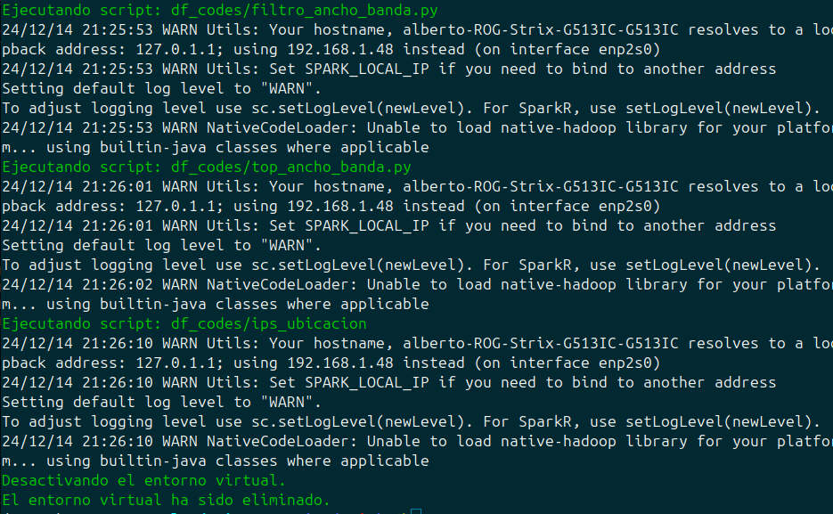
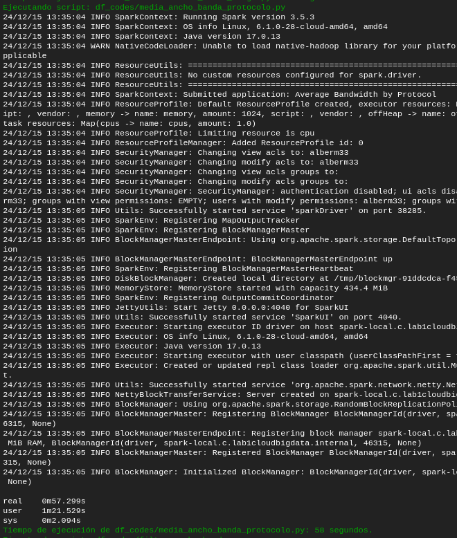
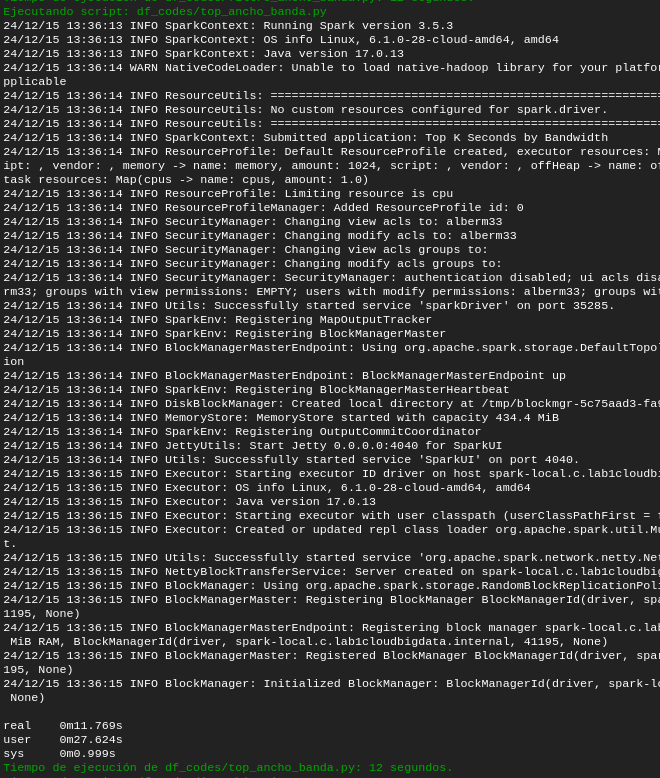
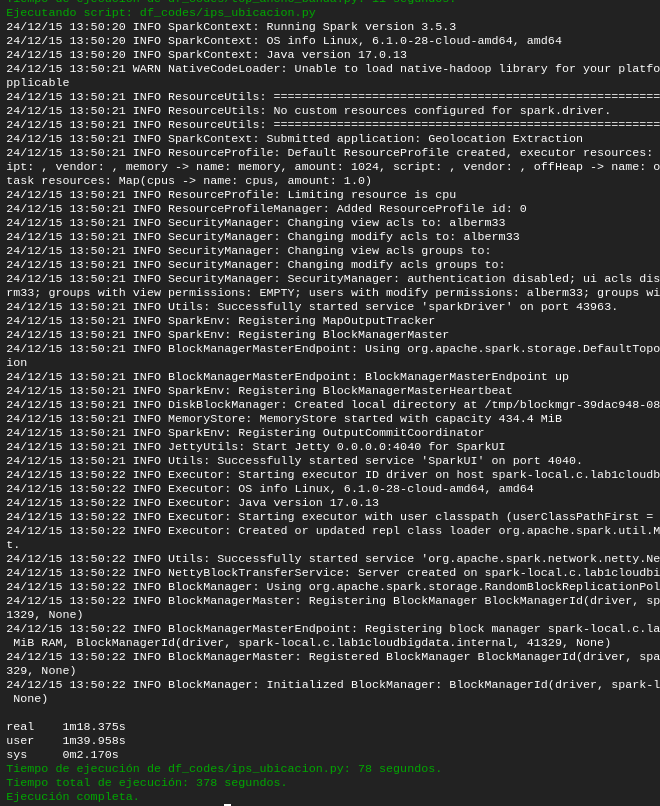

# Group9-Cloud-Big-Data

Proyecto final del grupo 9 de la asignatura de Cloud y Big Data de la Universidad Complutense de Madrid, Facultad de Informática, 2024-2025

---

## Índice

- [Group9-Cloud-Big-Data](#group9-cloud-big-data)
  - [Índice](#índice)
  - [Participantes](#participantes)
  - [Informe del Proyecto](#informe-del-proyecto)
    - [Descripción del problema](#descripción-del-problema)
    - [Necesidad del procesamiento de Big Data y la computación en la nube](#necesidad-del-procesamiento-de-big-data-y-la-computación-en-la-nube)
    - [Descripción de los datos: ¿De dónde provienen? ¿Cómo se adquirieron? ¿Qué significan? ¿En qué formato están? ¿Cuánto pesan (mínimo 1 GB)?](#descripción-de-los-datos-de-dónde-provienen-cómo-se-adquirieron-qué-significan-en-qué-formato-están-cuánto-pesan-mínimo-1-gb)
    - [Descripción Breve de la Aplicación, Modelos de Programación, Plataforma e Infraestructura](#descripción-breve-de-la-aplicación-modelos-de-programación-plataforma-e-infraestructura)
      - [**Descripción de la Aplicación**](#descripción-de-la-aplicación)
      - [**Modelos de Programación**](#modelos-de-programación)
      - [**Plataforma**](#plataforma)
      - [**Infraestructura**](#infraestructura)
    - [Diseño del software (diseño arquitectónico, base del código, dependencias…)](#diseño-del-software-diseño-arquitectónico-base-del-código-dependencias)
    - [Uso (incluyendo capturas de pantalla que demuestren su funcionamiento)](#uso-incluyendo-capturas-de-pantalla-que-demuestren-su-funcionamiento)
      - [**Uso fuera de la insfractuctura cloud**](#uso-fuera-de-la-insfractuctura-cloud)
      - [**Maquina local en el cloud**](#maquina-local-en-el-cloud)
      - [**Cluster**](#cluster)
      - [**Archivos outputs**](#archivos-outputs)
    - [Evaluación de rendimiento (aceleración) en la nube y discusión sobre los sobrecostes identificados y optimizaciones realizadas](#evaluación-de-rendimiento-aceleración-en-la-nube-y-discusión-sobre-los-sobrecostes-identificados-y-optimizaciones-realizadas)
      - [**Speed-up en maquina local con distintos hilos**](#speed-up-en-maquina-local-con-distintos-hilos)
      - [**Speed-up en maquina local con distinta cantidad de vCpus**](#speed-up-en-maquina-local-con-distinta-cantidad-de-vcpus)
      - [\*\*Speed-up en maquina local en la nube combinando hilos y vCpus](#speed-up-en-maquina-local-en-la-nube-combinando-hilos-y-vcpus)
      - [**Speed-up en cluster con distinta cantidad de nodos**](#speed-up-en-cluster-con-distinta-cantidad-de-nodos)
      - [**Speed-up en cluster con distinta cantidad de vCpus**](#speed-up-en-cluster-con-distinta-cantidad-de-vcpus)
    - [Características avanzadas, como herramientas/modelos/plataformas no explicadas en clase, funciones avanzadas, técnicas para mitigar los sobrecostes, aspectos de implementación desafiantes](#características-avanzadas-como-herramientasmodelosplataformas-no-explicadas-en-clase-funciones-avanzadas-técnicas-para-mitigar-los-sobrecostes-aspectos-de-implementación-desafiantes)
    - [Conclusiones, incluyendo objetivos alcanzados, mejoras sugeridas, lecciones aprendidas, trabajo futuro, ideas interesantes](#conclusiones-incluyendo-objetivos-alcanzados-mejoras-sugeridas-lecciones-aprendidas-trabajo-futuro-ideas-interesantes)
    - [Referencias](#referencias)

## Participantes

- Alberto Martin Oruña ([@Alberto12x](https://github.com/Alberto12x/))
- José Caleb Gálvez Valladares ([@JGalvez27](https://github.com/JGalvez27/))

---

## Informe del Proyecto

### Descripción del problema

Se plantea desarrollar un sistema capaz de procesar, analizar y extraer información relevante a partir de grandes volúmenes de datos de tráfico de red. Este análisis es fundamental para comprender el comportamiento de las redes, detectar patrones en los flujos de tráfico, identificar posibles anomalías y apoyar la toma de decisiones en la gestión de infraestructuras tecnológicas.

El problema central es el procesamiento eficiente de grandes conjuntos de datos de tráfico de red representados en archivos CSV.

El objetivo es realizar diversas tareas de procesamiento y análisis, tales como:

- Filtrar información relevante: Extraer eventos específicos, como banderas TCP, métodos HTTP y eventos TLS o quedarse solo con los  intervalos de tiempo de 1 segundo que mas o menos ancho de banda se ha necesitado.
- Construir índices invertidos: Mapear palabras clave (como "GET", "ACK" o "Client Hello") a los paquetes donde estas ocurren, permitiendo búsquedas rápidas y eficientes para futuros algoritmos que se podrian implementar de manera que la busqueda fuera más rapida.
- Obtener métricas clave: Calcular estadísticas como la frecuencia de protocolos, el ancho de banda promedio por protocolo y por intervalos de 1 segundo el paquete mas pequeño, el más grande, la media y la cantidad de paquetes que se han capturado en ese segundo.
- Obtener la localización de las ips de modo que se puede observar para casos como videos en directo desde donde está conectada la gente que te ve.
  
El desafío principal reside en la gran escala de los datos, que puede superar varios gigabytes (en el caso de la practica no pero el trafico en la red es muy grabde), y en la complejidad computacional de las tareas requeridas. Además, se busca garantizar la escalabilidad y eficiencia del procesamiento utilizando tecnologías de Big Data como Apache Spark, en combinación con infraestructuras Cloud que permitan trabajar con recursos distribuidos y escalables.

---

### Necesidad del procesamiento de Big Data y la computación en la nube

La necesidad de Big Data y computación en la nube en este proyecto radica en los retos inherentes al análisis y procesamiento de grandes volúmenes de datos de tráfico de red, que requieren herramientas y plataformas avanzadas para manejar su escala y complejidad. A continuación, se detallan las principales razones:

**1. Escalabilidad de los datos:**
Los datos de tráfico de red pueden alcanzar tamaños significativos, 400 exabytes de datos son generados al día,de los cuales gran parte se transmiten por la red; debido al volumen de paquetes generados incluso en redes moderadamente activas.
El manejo eficiente de estos volúmenes de datos excede las capacidades de los sistemas tradicionales, como bases de datos relacionales o scripts locales, lo que hace indispensable el uso de herramientas de Big Data como Apache Spark, diseñadas para procesar datos de forma distribuida.

**2. Complejidad del procesamiento:**
El análisis incluye tareas intensivas como filtrado, extracción de patrones, construcción de índices invertidos y cálculo de métricas clave. Estas operaciones implican:
Procesamiento de texto, como el análisis de la columna Info para extraer palabras clave (banderas TCP, métodos HTTP, eventos TLS).
Agregaciones a gran escala, como el cálculo de frecuencias o el mapeo de palabras clave a identificadores de paquetes.
Las tecnologías usadas en Big Data ofrece la potencia necesaria para realizar estas tareas en paralelo, reduciendo significativamente los tiempos de ejecución.

**3. Variabilidad y escalabilidad de los recursos:**
Los sistemas Cloud permiten escalar recursos computacionales dinámicamente según las necesidades:

- Añadir más nodos para acelerar el procesamiento.
- Usar configuraciones específicas (como nodos con alto rendimiento en procesamiento o memoria) según el tipo de tarea.
  
Esto reduce el costo, ya que solo se pagan los recursos utilizados, y mejora la eficiencia al evitar cuellos de botella.

**4. Tolerancia a fallos:**
Los sistemas distribuidos en la nube ofrecen tolerancia a fallos integrada, asegurando que el procesamiento no se detenga ante la falla de un nodo.
Esto es esencial para garantizar la confiabilidad en el análisis de grandes volúmenes de datos.

**5. Integración con otras herramientas:**
Las plataformas de Big Data y Cloud se integran fácilmente con tecnologías avanzadas:
Modelos de machine learning para identificar anomalías de red o predecir comportamientos.
Dashboards y herramientas de visualización para representar métricas clave en tiempo real.
Esto enriquece los resultados del análisis y aumenta el valor práctico del proyecto aunque no se haya implementado.

**6. Reducción de costos y facilidad de acceso:**
Las soluciones en la nube eliminan la necesidad de una infraestructura física costosa, ofreciendo un acceso sencillo a recursos de alto rendimiento.
En conclusión, el uso de tecnologías de Big Data y computación en la nube no solo es necesario, sino que es un componente clave para garantizar el éxito del proyecto, permitiendo procesar y analizar datos masivos de manera eficiente, escalable y rentable.

---

### Descripción de los datos: ¿De dónde provienen? ¿Cómo se adquirieron? ¿Qué significan? ¿En qué formato están? ¿Cuánto pesan (mínimo 1 GB)?

Se pueden descarga el dataset en este [enlace](https://www.kaggle.com/datasets/kimdaegyeom/5g-traffic-datasets?resource=download-directory) el cual le lleva a la página donde descargarlo.
Los datos provienen de [kaggle](https://www.kaggle.com/), del post de la siguiente url : [https://www.kaggle.com/datasets/kimdaegyeom/5g-traffic-datasets?resource=download-directory](https://www.kaggle.com/datasets/kimdaegyeom/5g-traffic-datasets?resource=download-directory). La url además contiene más datasets con trafico de red en contextos diferentes además de la descripción de como se han obtenido cada uno de ellos.
El conjunto de datos utilizados en nuestro proyecto proviene de la plataforma Afreeca TV, que se recolectó a través de la aplicación PCAPdroid en un terminal móvil Samsung Galaxy A90 5G, equipado con un módem Qualcomm Snapdragon X50 5G. El tráfico fue medido mientras se visualizaban transmisiones en vivo de Afreeca TV, sin tráfico de fondo, para analizar las características específicas de este tipo de tráfico.

AfreecaTV es una plataforma de transmisión en vivo y video bajo demanda que se originó en Corea del Sur. El nombre “AfreecaTV” se traduce como “Anybody can Freely Broadcast TV”, lo que refleja su enfoque en permitir a cualquier persona transmitir contenido de forma gratuita. [[1]]

Este conjunto de datos contiene información detallada de los paquetes de datos transmitidos, incluyendo direcciones de origen y destino, lo que permite un análisis completo del tráfico de la aplicación. Los datos están organizados en formato CSV y cubren un total de 328 horas de tráfico, lo que hace que sea adecuado para su uso en modelos de simulación de tráfico de red, para el entrenamiento de modelos de aprendizaje automático, como redes neuronales y técnicas de pronóstico de series temporales o para el cálculo de métricas para identificar cuellos de botellas y tomar decisiones para administrar la red. [[2]]

Los datos incluyen registros de paquetes que pasan a través de la red y están organizados con las siguientes columnas:

- **No.**: Número de secuencia del paquete.
- **Time**: Timestamp del paquete, que indica la fecha y hora exacta en la que se capturó el paquete.
- **Source**: Dirección IP de origen del paquete.
- **Destination**: Dirección IP de destino del paquete.
- **Protocol**: Protocolo de la capa de transporte utilizado (por ejemplo, TCP, HTTP).
- **Length**: Longitud del paquete en bytes.
- **Info**: Información adicional sobre el paquete, que puede incluir detalles sobre la conexión, como el tipo de mensaje (SYN, ACK, GET, etc.) y valores como el número de secuencia (Seq), número de acuse de recibo (Ack), tamaño de la ventana (Win), y otros parámetros del protocolo.
  
Ejemplo de entrada en el dataset:

| No. | Time                          | Source         | Destination    | Protocol | Length | Info |
|-----|-------------------------------|----------------|----------------|----------|--------|------|
| 1   | 2022-06-01 11:32:29.301134    | 10.215.173.1   | 218.38.31.68   | TCP      | 60     | 57192  >  3456 [SYN] Seq=0 Win=65535 Len=0 MSS=1460 SACK_PERM=1 TSval=3049657187 TSecr=0 WS=128 |
| 2   | 2022-06-01 11:32:29.327373    | 218.38.31.68   | 10.215.173.1   | HTTP    | 172     | GET /check?ip=110.10.76.232&port=19000 HTTP/1.1  |
| 3   | 2022-06-01 11:32:29.327541    | 10.215.173.1   | 218.38.31.68   | TLSv1.2      | 557     | Client Hello |
| 4   | 2022-06-01 11:32:30.276864    | 192.0.0.2      | 10.215.173.2   | TLSv1.3      | 1500     | Application Data, Application Data, Application Data |

El dataset que se ha utilizado en este proyecto pesa 1.3 GB, este tamaño ha hecho que recurramos a GIT LFS para poder almacenaro en github como pide el enunciado.


---

### Descripción Breve de la Aplicación, Modelos de Programación, Plataforma e Infraestructura

 #### **Descripción de la Aplicación**  

El proyecto es un sistema modular diseñado para analizar y procesar grandes conjuntos de datos de tráfico de red de manera eficiente. Sus principales objetivos son extraer información relevante, detectar patrones, identificar anomalías y apoyar en la gestión de infraestructuras de red. Aprovechando tecnologías de Big Data y computación en la nube, el sistema maneja gigabytes de datos de red almacenados en formato CSV. La aplicación incluye funcionalidades como el cálculo de métricas de ancho de banda, análisis de frecuencias de protocolos, índices invertidos para búsquedas más rápidas y geolocalización de direcciones IP. Está diseñada para garantizar escalabilidad y optimización del rendimiento.

#### **Modelos de Programación**  

El proyecto se basa en **Apache Spark**, un framework de computación distribuida, para procesar datos en paralelo. Utiliza **DataFrames** como abstracción principal para el procesamiento de datos, lo que aporta varias ventajas:

- **Lenguaje de Consultas de Alto Nivel**: Los DataFrames permiten realizar operaciones similares a SQL, simplificando las transformaciones complejas.
- **Ejecución Optimizada**: El optimizador Catalyst de Spark mejora el rendimiento generando planes de ejecución eficientes.
- **Computación Distribuida**: Las tareas se distribuyen entre nodos, habilitando el paralelismo.

Herramientas y bibliotecas clave utilizadas:

1. **PySpark**: Facilita la interacción con Spark desde Python.
2. **GeoIP2**: Proporciona capacidades de geolocalización de IPs.
3. **Python**: Es el lenguaje principal para la manipulación de datos y la orquestación.

Los scripts incluyen:

- Análisis de Ancho de Banda: Agrega métricas de tráfico en ventanas de 1 segundo.
  - Frecuencia de Protocolos: Calcula la frecuencia de uso de diferentes protocolos.
  - Índice Invertido: Mapea términos como flags TCP y métodos HTTP a paquetes asociados.
  - Geolocalización: Extrae información geográfica de direcciones IP únicas utilizando la base de datos GeoLite2.

El modelo de programación sigue el paradigma **MapReduce**, ya que Spark procesa los datos mediante transformaciones de mapeo y reduce los resultados en un entorno distribuido.

#### **Plataforma**  

La aplicación puede ejecutarse en:

1. **Entorno Local**: Usando un entorno virtual de Python para pruebas a pequeña escala.
2. **Infraestructura en la Nube**: El proyecto utiliza **Google Cloud Platform (GCP)** con instancias de máquinas virtuales para computación distribuida. Los scripts gestionan automáticamente la provisión y liberación de recursos, optimizando costes y uso.

#### **Infraestructura**  

La infraestructura combina los siguientes elementos:

1. **Recursos de Cómputo**:
   - **Máquinas Virtuales**: Instancias personalizables creadas dinámicamente en GCP para soportar tareas distribuidas con Spark.
   - **Configuración Local**: Entornos virtuales en Python 3.12 con dependencias instaladas desde requirements.txt. Los conjuntos de datos y los resultados se gestionan localmente para cargas de trabajo menores o pruebas.
2. **Almacenamiento**:
   - **Sistema de Archivos Distribuido**: Spark procesa entradas desde almacenamiento de objetos en la nube (por ejemplo, GCP Cloud Storage).
   - **Almacenamiento Local**: Usado para resultados intermedios durante pruebas locales.
3. **Redes**:
   - El conjunto de datos incluye campos relacionados con IPs, permitiendo simulaciones de optimización y enrutamiento de redes.
   - La transferencia de datos dentro de GCP optimiza costes mediante su red interna.
4. **Seguridad**:
   - Asegurada mediante políticas de IAM (Gestión de Identidades y Accesos).
   - El acceso a la base de datos GeoLite2 y a los conjuntos de datos está restringido a procesos autorizados.

---

### Diseño del software (diseño arquitectónico, base del código, dependencias…)

El diseño arquitectónico de la aplicación se basa en una arquitectura modular, donde cada componente tiene una función específica en el procesamiento de datos de red. Los principales módulos son los siguientes:

- **Módulo de Cálculo de Ancho de Banda**: Este módulo calcula métricas de ancho de banda, como el total de bytes, el ancho de banda en bps, la longitud mínima, máxima y promedio de los paquetes, sobre ventanas de tiempo de un segundo.

- **Módulo de Filtrado por Ancho de Banda**: Este módulo filtra los datos según un umbral de ancho de banda definido por el usuario, permitiendo seleccionar solo los paquetes que cumplen con ciertos criterios establecidos.

- **Módulo de Frecuencia de Protocolos**: Este módulo calcula la frecuencia de aparición de diferentes protocolos en el tráfico de red, ayudando a identificar patrones de uso a lo largo del tiempo.

- **Módulo de Índice Invertido de Paquetes**: Este módulo genera un índice invertido de los paquetes basado en las palabras clave extraídas de los campos de información de los paquetes, como las banderas TCP, eventos HTTP y TLS. Este índice permite realizar búsquedas eficientes asociando paquetes con términos o palabras clave específicas.

- **Módulo de Geolocalización de IPs**: Este módulo utiliza la base de datos GeoLite2 para obtener información geográfica de las direcciones IP presentes en los paquetes, generando una lista única de países y ciudades asociadas con las direcciones IP.

- **Módulo de Promedio de Ancho de Banda por Protocolo**: Este módulo calcula el promedio de ancho de banda por cada protocolo, proporcionando una visión detallada del uso de la red por protocolo.

El código está escrito en Python y se organiza en varios scripts que realizan tareas específicas dentro del flujo de trabajo general de la aplicación. Cada uno de estos scripts utiliza Apache Spark para procesar los datos en paralelo y generar resultados de manera eficiente. Además incluimos scripts para su ejecucion en local y ejecucion en clusters encargandose el script tanto de su creación como de su destruccion.

En lugar de trabajar con RDDs (Resilient Distributed Datasets), el código emplea DataFrames de Apache Spark, ya que proporcionan una abstracción de alto nivel que permite realizar consultas más optimizadas y legibles. Los DataFrames ofrecen un conjunto más amplio de operaciones integradas, lo que hace que las tareas de transformación y agregación de datos sean más fáciles de implementar.

A continuación se describen las principales librerías utilizadas en el proyecto y su propósito, el resto de librerias se pueden encontrar en el archivo [requeriments.txt](./requeriments.txt):

- **geoip2**: Esta librería se utiliza para la geolocalización de direcciones IP, extrayendo información como país y ciudad a partir de bases de datos como GeoLite2.
- **pyspark**: La principal librería utilizada para trabajar con Apache Spark desde Python. Proporciona las clases y funciones necesarias para trabajar con DataFrames y realizar operaciones distribuidas

Ademas es necesario descargarse la base de datos [GeoLite2-City.mmdb](https://github.com/P3TERX/GeoLite.mmdb/raw/download/GeoLite2-City.mmdb) la cual proviene de este [repositorio de github](https://github.com/P3TERX/GeoLite.mmdb?tab=readme-ov-file). Los scripts de ejcución ya se encargan de su descarga.

---

### Uso (incluyendo capturas de pantalla que demuestren su funcionamiento)

#### **Uso fuera de la insfractuctura cloud**

```bash
./script_ejecucion_local.sh <ancho de banda para el filtro> <Comparador 1 > , 0 <= > <top k> <dataset>
```

```bash
/script_ejecucion_local.sh  -h
```

Que devuelve

```shell
Uso: ./script_ejecucion_local.sh <opciones>

Opciones:
  -h, --help                   Muestra este mensaje de ayuda.
  <ancho de banda para el filtro> <Comparador 1 > , 0 <= > <top k> <dataset>
    - <ancho de banda para el filtro> es el valor límite de ancho de banda.
    - <Comparador> es el tipo de comparador para el filtro. Puede ser 1 o 0 siendo > y <= respectivamente.
    - <top k> es el valor k para el filtro Top-K.
    - <dataset> es la ubicación del archivo de datos para procesar.
```

Ejemplos :

```bash
./script_ejecucion_local.sh 22222 1 10 test.csv
```

```bash
./script_ejecucion_local.sh 345546546 0 1000 Afreeca.csv
```

La ejecución de alguno de los dos ejemplos anteriores genera el siguiente directorio:


Con un contenido similar en cada directorio:


Capturas de pantalla del uso:


Mensajes de ayuda




Funcionamiento

#### **Maquina local en el cloud**

Para ejecutar la aplicación en una  maquina local de GCP hemos hecho varios scripts para ocuparnos de la creación , ejecución y eliminación de la maquina.

Creación de la maquina:

```bash
./crear_maquina.sh -h
```

Salida:

```bash
Uso: ./crear_maquina.sh -t TIPO_DE_MAQUINA [-h]

Opciones:
  -t TIPO_DE_MAQUINA   Especifica el tipo de máquina (e.g., e2-standard-4, custom-8-16384)
  -h                   Muestra esta ayuda y termina
```

Ejemplo de ejecución,creacion de una maquina con 4 vCpus y 16 GB de RAM:

```bash
/crear_maquina.sh -t e2-standard-4
```

Salida:

```bash
Creando instancia con tipo de máquina: e2-standard-4
Created [https://www.googleapis.com/compute/v1/projects/lab1cloudbigdata/zones/europe-southwest1-a/instances/spark-local].
NAME: spark-local
ZONE: europe-southwest1-a
MACHINE_TYPE: e2-standard-4
PREEMPTIBLE: 
INTERNAL_IP: 10.204.0.33
EXTERNAL_IP: 34.175.252.53
STATUS: RUNNING
Instancia creada exitosamente.
```

Nos conectamos por ssh y subimos los archivos correspondientes para que quede el directorio de la siguiente manera:


Ejecución de la aplicación:

```bash
./ejecucion_spark.sh -h
```

Salida:

```bash
Uso: ./ejecucion_spark.sh <ruta_dataset> <output_dir> [filter_bandwidth] [comparator] [top_k] [num_threads]
Parámetros:
  <ruta_dataset>       Ruta al dataset a procesar
  <output_dir>         Directorio donde se guardarán los resultados
  [filter_bandwidth]   (Opcional) Ancho de banda para el filtro
  [comparator]         (Opcional) Comparador para el filtro
  [top_k]              (Opcional) Valor k para el top k
  [num_threads]        (Opcional) Número de hilos para Spark (local[i])
  -h   
```

Ejemplo:

```bash
./ejecucion_spark.sh AfreecaTV.csv output 121212 0 23 1
```

Salida en la terminal:









Esta ejecucion genera la misma estructura de directorios que la ejecución en local fuera del cloud:


Con un contenido similar entre todas ellas:


Borrado de la maquina:

```bash
./borrar_maquina.sh -h
```

Salida:

```bash
Uso: ./borrar_maquina.sh [-h]

Opciones:
  -h    Muestra este mensaje de ayuda y sale.

Este script elimina la instancia 'spark-local' en Google Cloud Compute.
```

Ejemplo:

```bash
./borrar_maquina.sh
```

Salida:

```bash
Deleted [https://www.googleapis.com/compute/v1/projects/lab1cloudbigdata/zones/europe-southwest1-a/instances/spark-local].

```

#### **Cluster**

#### **Archivos outputs**

---

### Evaluación de rendimiento (aceleración) en la nube y discusión sobre los sobrecostes identificados y optimizaciones realizadas

Para calcular los speed ups se ha utlizado la siguiente formula: $Speed\text{-}up = \frac{T_{control}}{T_{modificacion}}$ definiendo la maquina de control en cada apartado

#### **Speed-up en maquina local con distintos hilos**


| Hilos | Ancho de Banda (s) | Speed-up Ancho de Banda | Frecuencia de Protocolos (s) | Speed-up Frecuencia de Protocolos | Inverted Index (s) | Speed-up Inverted Index | Media Ancho de Banda (s) | Speed-up Media Ancho de Banda | Filtro Ancho de Banda (s) | Speed-up Filtro Ancho de Banda | Top Ancho de Banda (s) | Speed-up Top Ancho de Banda | IPs Ubicación (s) | Speed-up IPs Ubicación | Total Módulos (s) | Speed-up Total |
|-------|---------------------|-------------------------|-----------------------------|-----------------------------------|---------------------|-------------------------|---------------------------|-------------------------------|---------------------------|-----------------------------|------------------------|-------------------------|--------------------|--------------------|-------------------|----------------|
| 1     | 62                  | 1.00                   | 55                          | 1.00                              | 123                 | 1.00                   | 58                        | 1.00                         | 12                        | 1.00                       | 12                     | 1.00                   | 78                 | 1.00                | 378               | 1.00           |
| 2     | 37                  | 1.68                   | 37                          | 1.49                              | 69                  | 1.78                   | 34                        | 1.71                         | 11                        | 1.09                       | 11                     | 1.09                   | 47                 | 1.66                | 246               | 1.54           |
| 3     | 40                  | 1.55                   | 37                          | 1.49                              | 66                  | 1.86                   | 37                        | 1.57                         | 11                        | 1.09                       | 12                     | 1.00                   | 48                 | 1.63                | 251               | 1.51           |
| 4     | 41                  | 1.51                   | 35                          | 1.57                              | 66                  | 1.86                   | 33                        | 1.76                         | 12                        | 1.00                       | 11                     | 1.09                   | 49                 | 1.59                | 247               | 1.53           |
| 5     | 36                  | 1.72                   | 37                          | 1.49                              | 65                  | 1.89                   | 36                        | 1.61                         | 11                        | 1.09                       | 12                     | 1.00                   | 48                 | 1.63                | 245               | 1.54           |
| 6     | 38                  | 1.63                   | 38                          | 1.45                              | 69                  | 1.78                   | 35                        | 1.66                         | 12                        | 1.00                       | 12                     | 1.00                   | 51                 | 1.53                | 255               | 1.48           |


#### **Speed-up en maquina local con distinta cantidad de vCpus**

Control = 4 vCpus , 1 hilos

Ancho_banda: 62 segundos
Frecuencia de protocolos: 55 segundos
Inverted index: 123 segundos
Media ancho de banda por protocolo: 58 segundos
Filtro ancho de banda: 12 segundos
Top ancho de banda: 12 segundos
Ips ubicacion: 78 segundos
Total de módulos: 378 segundos

8 vCpus
Ancho_banda: 54 segundos
Frecuencia de protocolos: 49 segundos
Inverted index: 98 segundos
Media ancho de banda por protocolo: 55 segundos
Filtro ancho de banda: 10 segundos
Top ancho de banda: 10 segundos
Ips ubicacion: 68 segundos
Total de módulos: 339 segundos

16 vCpus
Ancho_banda: 62 segundos
Frecuencia de protocolos: 55 segundos
Inverted index: 123 segundos
Media ancho de banda por protocolo: 58 segundos
Filtro ancho de banda: 12 segundos
Top ancho de banda: 12 segundos
Ips ubicacion: 78 segundos
Total de módulos: 378 segundos

#### **Speed-up en maquina local en la nube combinando hilos y vCpus

No hemos dispuesto de timpoi suficiente como probar una gran combinación pero intuimos observando los speed-up anteriores que el mismo número de hilos  que de vCpus alcanza un valor de speed-up cercano al máximo alcanzable

Control = 4 vCpus , 1 hilos

Ancho_banda: 62 segundos
Frecuencia de protocolos: 55 segundos
Inverted index: 123 segundos
Media ancho de banda por protocolo: 58 segundos
Filtro ancho de banda: 12 segundos
Top ancho de banda: 12 segundos
Ips ubicacion: 78 segundos
Total de módulos: 378 segundos

8 vCpus, 2 hilos

Ancho_banda: 38 segundos
Frecuencia de protocolos: 36 segundos
Inverted index: 65 segundos
Media ancho de banda por protocolo: 36 segundos
Filtro ancho de banda: 10 segundos
Top ancho de banda: 10 segundos
Ips ubicacion: 42 segundos
Total de módulos: 237 segundos

8 vCpus, 8 hilos

Ancho_banda: 26 segundos
Frecuencia de protocolos: 23 segundos
Inverted index: 41 segundos
Media ancho de banda por protocolo: 23 segundos
Filtro ancho de banda: 11 segundos
Top ancho de banda: 10 segundos
Ips ubicacion: 32 segundos
Total de módulos: 166 segundos

16 vCpus, 2 hilos

Ancho_banda: 62 segundos
Frecuencia de protocolos: 55 segundos
Inverted index: 123 segundos
Media ancho de banda por protocolo: 58 segundos
Filtro ancho de banda: 12 segundos
Top ancho de banda: 12 segundos
Ips ubicacion: 78 segundos
Total de módulos: 378 segundos

16 vCpus, 16 hilos

Ancho_banda: 62 segundos
Frecuencia de protocolos: 55 segundos
Inverted index: 123 segundos
Media ancho de banda por protocolo: 58 segundos
Filtro ancho de banda: 12 segundos
Top ancho de banda: 12 segundos
Ips ubicacion: 78 segundos
Total de módulos: 378 segundos


#### **Speed-up en cluster con distinta cantidad de nodos**

#### **Speed-up en cluster con distinta cantidad de vCpus**

---

### Características avanzadas, como herramientas/modelos/plataformas no explicadas en clase, funciones avanzadas, técnicas para mitigar los sobrecostes, aspectos de implementación desafiantes

### Conclusiones, incluyendo objetivos alcanzados, mejoras sugeridas, lecciones aprendidas, trabajo futuro, ideas interesantes

### Referencias

[[1]] (<https://en.wikipedia.org/wiki/SOOP>)

[[2]] (<https://www.kaggle.com/datasets/kimdaegyeom/5g-traffic-datasets?resource=download-directory>)

[1]: https://en.wikipedia.org/wiki/SOOP
[2]: https://www.kaggle.com/datasets/kimdaegyeom/5g-traffic-datasets?resource=download-directory
